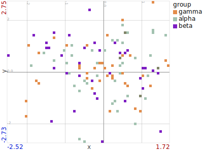
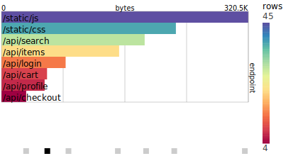
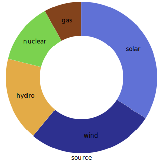
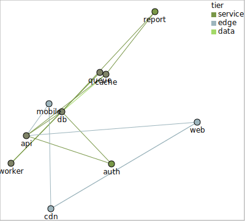
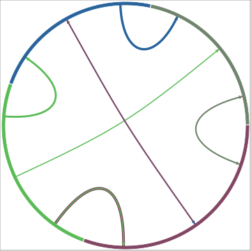
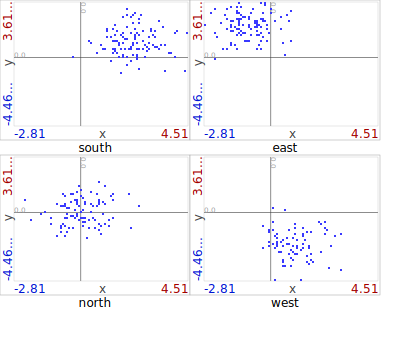

# Gallery

Every chart below is a real polars2svg render, generated from seeded random
data by [`docs/gen_examples.py`](https://github.com/datrcode/polars2svg/blob/main/docs/gen_examples.py).
Click through for the code that produced each one.

## [xyp — scatter](xyp.md)

Each row becomes a dot at (x, y); axes may be numeric or categorical.

## [histop — histogram](histop.md)

One horizontal bar per category/bin; bar length and bar color are independent
encodings.

## [timep — temporal bars](timep.md)

Time binned along the x-axis — chronological, or folded into a repeating cycle
(day-of-week below).

## [piep — pie / donut](piep.md)

Bins become slices; mirrors histop's parameters.

## [linkp — network](linkp.md)

Node-link graph from an edge list, with pluggable layouts.

## [chordp — chord diagram](chordp.md)

Weighted flows as ribbons around a circle.

## [spreadlinesp — spread lines](spreadlinesp.md)

Egocentric influence over time: senders above the ego line, receivers below.

## [smallp — small multiples](smallp.md)

A grid of one template component, faceted by a field with shared axes.

