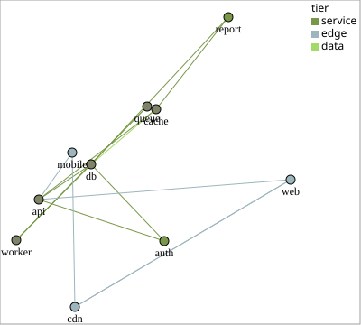

# linkp — node-link graph / network

Each `relationships` pair contributes an edge and its endpoint nodes. Nodes
are placed by `pos=` (a networkx-style `{node: [x, y]}` dict) or given random
positions; layout classes like `TFDPLayout` (GPU-accelerated t-FDP) produce
`pos` dicts. Node and link size, color, opacity, shape, labels, convex hulls,
and shapely backgrounds are all configurable.

Requires the `[layouts]` extra: `pip install polars2svg[layouts]`.



```python
edges = [("api", "auth"), ("api", "db"), ("api", "cache"), ("auth", "db"),
         ("web", "api"), ("web", "cdn"), ("worker", "db"), ("worker", "queue"),
         ("queue", "worker"), ("cache", "db"), ("cdn", "web"), ("mobile", "api"),
         ("mobile", "cdn"), ("report", "db"), ("report", "cache")]
tier = {"web": "edge", "mobile": "edge", "cdn": "edge",
        "api": "service", "auth": "service", "worker": "service",
        "report": "service", "db": "data", "cache": "data", "queue": "data"}
df = pl.DataFrame({"src":  [a for a, _ in edges],
                   "dst":  [b for _, b in edges],
                   "tier": [tier[a] for a, _ in edges]})

p2s.linkp(df, [("src", "dst")], node_color="tier", color="tier",
          node_size="medium", draw_node_labels=True, wxh=(400, 360), legend=True)
```

## Key parameters

| Parameter | Forms | Notes |
|-----------|-------|-------|
| `relationships` | `[('from', 'to')]`, `[('from', 'to', 'predicate')]`, tuple fields | Tuple fields concatenate with `\|`. |
| `pos` | `{node: [x, y], ...}` | networkx-style; nodes absent from `pos` get random positions. |
| `color` | `'field'`, `'#rrggbb'`, `p2s.CROW_MAGNITUDEp` … | Applies to links and nodes; `node_color=` overrides for nodes. |
| `node_size`, `link_size` | `'small' / 'medium' / ... '`, `'vary'` | Fixed sizes by default. |
| `count` | `p2s.ROW_COUNTp`, `'field'`, … | **Only drives geometry once `node_size='vary'` / `link_size='vary'`** — at fixed sizes it has no visible effect (a one-time warning fires if set anyway). |
| `draw_node_labels` | `True` / `False` | Node labels; default `False`. `node_labels={value: display}` renames what is drawn. |
| `draw_link_labels` | `True` / `False` | Edge labels; default `False`. Read from the **third** element of a relationship tuple — `[('src', 'dst', 'predicate')]` — so a two-element `relationships` has nothing to draw. `link_labels={value: display}` renames them. |
| `background` | `{name: shape}` | Shapes drawn beneath the links in **world** coordinates, so they pan and zoom with the layout. A shape is shapely geometry, a `[(x, y), ...]` ring, an SVG path/circle string, or a `p2s.bgShape(...)` record carrying its own appearance. |
| `legend` | `True`, position string, dict | |

!!! warning "Renamed in 0.2.0"
    `linkp`'s `draw_labels=` is now `draw_node_labels=` — with edges labelable
    too, one flag could no longer say which channel it meant. Passing
    `draw_labels=` raises `TypeError` naming the replacement. The rename is
    linkp-only: `piep`, `histop`, `chordp` and `smallp` keep plain
    `draw_labels=`.

!!! note "count= vs CROW_* color"
    `CROW_MAGNITUDEp` / `CROW_STRETCHEDp` color by **raw row count**, not by
    `count=` — the two are independent by design. Details in
    [count= and color=](../guides/count-color.md).

## Flow-field backgrounds

`FlowFieldBackground` reads the positions a `linkp` is already drawing, plus the
edge records behind them, and returns a `background=` dict showing which way traffic
moves. It is a background producer, not a layout — it moves no nodes:

```python
ffb = p2s.FlowFieldBackground(df, [("src", "dst")], pos=pos, k_layers=2)
p2s.linkp(df, [("src", "dst")], pos, background=ffb.cells())
```

`k_layers=` is why it exists: a vector field holds one vector per point, so two
hosts talking both ways cancel to zero. Splitting the edges into K internally
coherent layers (2 by default — dominant flow, plus what fights it) and drawing one
field per layer keeps both directions visible. Every edge lands in exactly one
layer. Each cell carries its own appearance, so no `background_*` arguments
accompany it. Full signature in the [API reference](../api.md#backgrounds).

Interactive variant: `p2s.linkpi(...)` is a full graph editor — drag, wheel
zoom, layout pickers, keyboard shortcuts, layout save/load. See
[Interactivity](../guides/interactivity.md).
