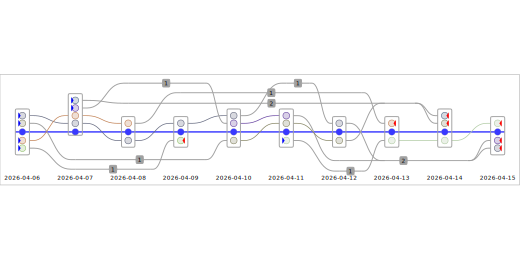

# spreadlinesp — egocentric spread lines

Visualizes egocentric dynamic influence over time (the SpreadLine layout).
Time flows left → right; each timestamp becomes a vertical bin of packed
circles. Circles **above** the ego line are senders (they contacted the ego);
circles **below** are receivers (the ego contacted them). Numbered badges mark
reappearing nodes hopping between bins.



```python
# ten days of messages between alice and seven colleagues
df = pl.DataFrame({"src": senders, "dst": receivers, "ts": timestamps})

p2s.spreadlinesp(df, [("src", "dst")], ego="alice", time="ts", wxh=(520, 260))
```

## Key parameters

| Parameter | Forms | Notes |
|-----------|-------|-------|
| `relationships` | `[('from', 'to')]` | |
| `ego` | `'node'`, `{'node_a', 'node_b', ...}` | A set ego is collapsed into a single virtual ego. |
| `time` | `'field'`, `('field', TimeLinearTypeP)` | Bare field auto-resolves granularity; see [t-fields](../guides/t-fields.md). |
| `node_color` | default hash, `p2s.COLOR_BY_NODE_NAME`, `'#rrggbb'`, `{node: hex}`, `'field'` | |
| `count` | `p2s.ROW_COUNTp` (default), `'field'`, `('field', p2s.SETp)` | Controls the **within-bin sort order** of circles (by edge weight) — circle size is packing-determined. |
| `anno` | annotations | spreadlinesp supports an annotation layer. |
| `legend` | `True`, position string, dict | Auto-selected from the resolved color mode. |

Interactive variant: `p2s.spreadlinepi(...)`.
