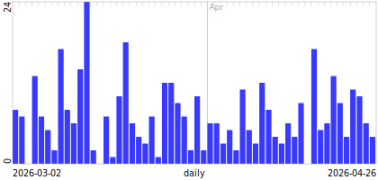
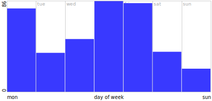

# timep — temporal bar chart

The time column is binned along the x-axis and each bin becomes a vertical
bar. Time is either **linear** (chronological, resolution auto-chosen or
forced) or **periodic** (folded into a repeating cycle — day-of-week, month,
hour, …). Bar height is `count=` (row count by default), bar color the
orthogonal `color=`.

## Linear time

Eight weeks of events, auto-binned daily:



```python
p2s.timep(df, "timestamp", wxh=(420, 200))
```

## Periodic time

The same events folded onto day-of-week — the weekday/weekend rhythm pops out:



```python
p2s.timep(df, p2s.tField("timestamp", p2s.PT_DoWp), wxh=(420, 200))
```

`p2s.tField(column, enum)` is the [t-field](../guides/t-fields.md) mechanism —
it works anywhere a time spec is accepted, and the enum picks the fold:
`PT_DoWp` (day of week), `PT_mp` (month), `PT_Hp` (hour), and a dozen more.

## Key parameters

| Parameter | Forms | Notes |
|-----------|-------|-------|
| `time` | `'field'`, `p2s.tField('field', enum)`, `('field', enum)` | Bare field → linear time, auto resolution. Omit it entirely and the time field is auto-detected. |
| `count` | `p2s.ROW_COUNTp` (default), `'field'`, `('field', p2s.SETp)` | Bar height. Numeric field → sum; non-numeric → distinct count. |
| `color` | `'field'`, `('field', COLOR_ENUM)`, `p2s.CROW_MAGNITUDEp` … | Bare string → stacked segments; bare numeric → whole-bar spectrum. |
| `style` | bars (default), boxplot, swarm, stacked bar | |
| `count_range` | `(min, max)` | Fix the height scale across [small multiples](smallp.md). |
| `legend` | `True`, position string, dict | |

Interactive variant: `p2s.timepi(...)`.
