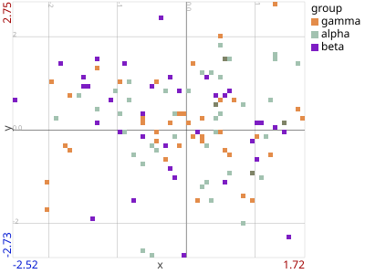

# xyp — scatter / distribution plot

Each row becomes a dot at (x, y). Both axes accept numeric **or** categorical
(set-based) fields, multiple fields (vstacked), or tuples (converted to structs
and ordered). Dot color, size, and opacity are independently data-drivable, and
optional distributions, connecting lines, and shapely background shapes layer
on top.



```python
import random
import polars as pl
from polars2svg import Polars2SVG

p2s = Polars2SVG()

random.seed(7)
n = 120
df = pl.DataFrame({
    "x":     [random.gauss(0, 1) for _ in range(n)],
    "y":     [random.gauss(0, 1) for _ in range(n)],
    "group": [random.choice(["alpha", "beta", "gamma"]) for _ in range(n)],
})

p2s.xyp(df, "x", "y", color="group", dot_size=5, wxh=(400, 300), legend=True)
```

## Key parameters

| Parameter | Forms | Notes |
|-----------|-------|-------|
| `x`, `y` | `'field'`, `('f1', 'f2', ...)`, `['f1', 'f2', ...]` | Numeric fields default to scalar axes, everything else to categorical. Pin intent with `p2s.SCALARp` / `p2s.SETp` in the spec. |
| `color` | `'field'`, `('field', COLOR_ENUM)`, `'#RRGGBB'`, `p2s.CROW_MAGNITUDEp` … | Bare numeric field → magnitude spectrum; bare non-numeric → categorical. See [count= and color=](../guides/count-color.md). |
| `dot_size` | `int`, `float`, `'field'`, `p2s.ROW_COUNTp` | An **integer** size triggers the pixel-grid pipeline; field-driven sizes scale within `dot_size_range=(0.5, 4.0)`. |
| `opacity` | `float`, `'field'`, `p2s.ROW_COUNTp` | Field-driven opacity scales within `opacity_range=(0.5, 1.0)`. |
| `x_order`, `y_order` | list or `{value: rank}` dict | Ordering for categorical axes; unlisted values sort last. |
| `aspect` | `None`, `'equal'`, `'geo'`, positive number | Lock the ratio between the two axis scales so the plot is not stretched to the canvas. See [below](#aspect-ratio). |
| `legend` | `True`, `'right'/'left'/'top'/'bottom'`, dict | Swatch list for categorical color, colorbar for spectrum modes. |
| `wxh` | `(width, height)` | Output size in pixels. |

## Aspect ratio

By default each axis independently fills its own pixel extent, so a dataset whose
shape does not match the canvas `wxh` ratio is stretched to fit it. That is usually
what you want for abstract data and wrong for anything spatial — a map of a city
comes out visibly squashed.

`aspect=` pins the ratio between the two axis scales:

| Value | Meaning |
|-------|---------|
| `None` *(default)* | Each axis fills its own pixel extent independently. |
| `'equal'` | One world unit is the same length on both axes. |
| `'geo'` | `x` is degrees longitude, `y` is degrees latitude. |
| a positive number | pixels-per-y-unit / pixels-per-x-unit, as in matplotlib's `set_aspect()`. |

```python
p2s.xyp(df, "lon", "lat", aspect="geo", wxh=(600, 400))
```

The correction *widens* the over-magnified axis about its center, so the plot gains
empty margin rather than losing data — every point visible without `aspect=` is still
visible with it. One consequence worth knowing: `x_range=` / `y_range=` become a
**floor** for the visible window rather than a ceiling, and rows the widening brings
into view are drawn rather than leaving an empty band inside the frame.

`'geo'` is a plate carrée centered on the data — a degree of longitude covers
cos(latitude) as much ground as a degree of latitude, so it is given cos(lat) as many
pixels. It is the usual good-enough correction for a regional extent, not a
reprojection, and will not stay true across a latitude span wide enough for the
curvature of the earth to matter.

`aspect=` requires numeric x and y axes; a categorical or temporal axis raises
`ValueError`.

`xyp` has no `count=` parameter — its size analog is `dot_size=`, and
`p2s.ROW_COUNTp` stands in for row count wherever a field is accepted.

Interactive variant: `p2s.xypi(...)` — same signature, linked brushing via
[panelize](../guides/interactivity.md).
